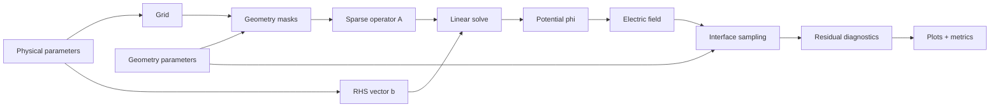

# Data Flow

Tags: #solver #data_flow

This note defines how information moves through the solver.

## High-level data flow

## Inputs

Physical parameters:

- applied voltage \(V_0\),
- electrode spacing \(L\),
- nozzle radius,
- surface tension \(\gamma\),
- permittivity \(\varepsilon_g\),
- optional conductivity \(\sigma_l\),
- optional shielding parameters \(\rho_0,\ell,E_c,E_s,\rho_{\max}\).

Numerical parameters:

- grid size \(N_r,N_z\),
- domain extents \(R_{\max},Z_{\max}\),
- boundary condition choices,
- solver tolerance,
- under-relaxation factor \(\omega\).

Geometry parameters:

- interface representation,
- electrode positions,
- powered/grounded masks,
- apex location,
- far-boundary shape.

## Outputs

Field outputs:

- \(\phi(r,z)\),
- \(E_r,E_z,|E|\),
- \(\rho_e(r,z)\), if Poisson shielding is active.

Interface outputs:

- sampled interface points,
- normals,
- curvature,
- Maxwell pressure,
- capillary pressure,
- residual \(\mathcal R\).

Scalar diagnostics:

- RMS residual,
- max residual,
- predicted half-angle,
- peak electric field,
- shielding metric,
- runtime,
- memory estimate,
- convergence status.
