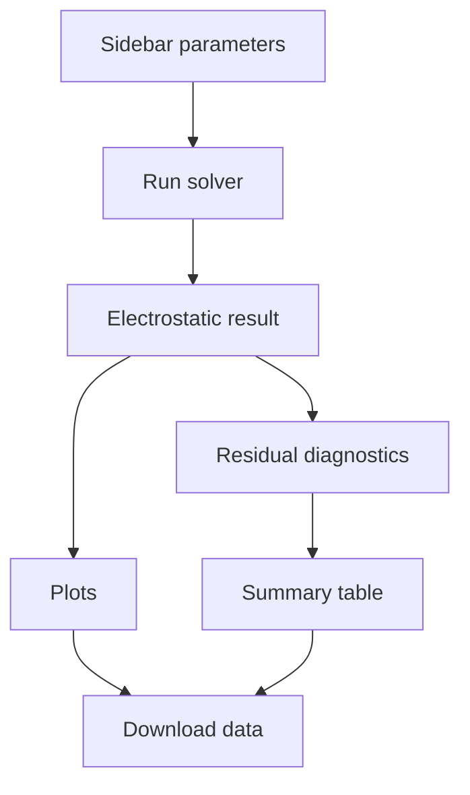

# Online App Interface

Tags: #app #streamlit #interface

The future online solver should expose physics controls and hide numerical complexity unless advanced mode is enabled.

## User inputs

Basic inputs:

- applied voltage \(V_0\),
- electrode spacing \(L\),
- nozzle radius,
- surface tension \(\gamma\),
- domain size,
- grid resolution.

Space-charge inputs:

- shielding model: none / Gaussian / threshold,
- \(\rho_0\),
- \(\ell\),
- \(E_c\),
- \(E_s\),
- \(\rho_{\max}\),
- under-relaxation \(\omega\).

Advanced inputs:

- boundary condition selection,
- optimizer settings,
- residual weighting,
- solver tolerance.

## Outputs

Visual outputs:

- potential contour plot,
- electric field magnitude plot,
- interface geometry overlay,
- Maxwell pressure along interface,
- residual along interface,
- space-charge density map.

Scalar outputs:

- predicted half-angle,
- peak field,
- RMS residual,
- shielding metric,
- runtime,
- convergence status.

## App flow

## ISEF presentation value

The app demonstrates:

- accessibility,
- reproducibility,
- fast parameter sweeps,
- clear comparison of Laplace vs Poisson shielding,
- consumer-hardware feasibility.

Links: [[03_Module_Map]], [[02_Data_Flow]]
